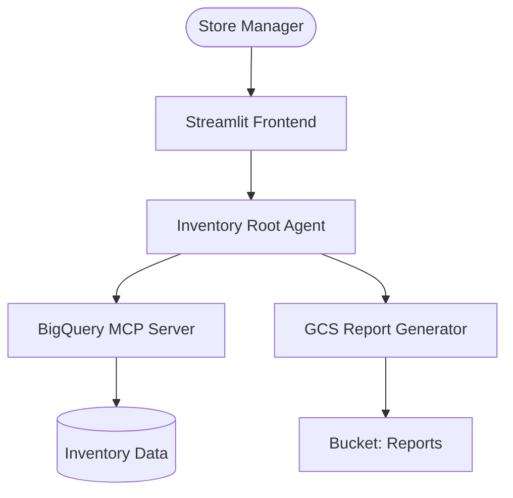

# Technical Design: Inventory Analysis Agent

**FDE Lead(s):** Antigravity
**Last updated:** 2026-02-24

---

# Executive Summary
The Inventory Analysis Agent is a GenAI-powered solution designed to automate inventory auditing and provide predictive reordering recommendations for RetailCo. It leverages Gemini and the Google Agent Development Kit (ADK) to bridge the gap between BigQuery data warehouses and store-level operations.

# System Architecture

## High-Level Diagram

## Architecture Principles
*   **Modularity:** Logic is partitioned into specialized MCP servers (BigQuery, GCS).
*   **Scalability:** Horizontal scaling via Cloud Run with request-based concurrency.
*   **Resilience:** Chain-of-Thought (CoT) reasoning with structured error fallbacks.

## Technical Components & Agent Logic
*   **Framework:** Google Agent Development Kit (ADK).
*   **Root Agent:** `inventory_analysis_agent`
*   **Reasoning Strategy:** Plan-and-Execute. The agent decomposes high-level requests into sequential data queries and analysis steps.
*   **Compute:** Cloud Run G2 instances with 4GiB RAM.
*   **Memory:** Firestore-backed session persistence for multi-turn inventory inquiries.

## Tooling & External Integrations
*   **MCP Servers:**
    *   `bq-inventory-server`: Handles complex SQL generation and execution.
    *   `report-gen-server`: Converts raw analysis into formatted PDF/Excel reports.
*   **Discovery:** Dynamic tool mapping via standard MCP SSE transport.
*   **Authentication:** Service Account-to-Service Account (SA-SA) using Workload Identity.

# Infrastructure, Security, & IAM

## GCP Project Structure
*   **Dev Project ID:** `retailco-inventory-dev`
*   **Region:** `us-central1`

## User Authentication (AuthN)
*   **Identity Provider:** Identity-Aware Proxy (IAP) integrated with RetailCo's Google Workspace.

## Authorization (AuthZ)
*   **RBAC:** 
    *   `Admin`: Full system configuration and tool management.
    *   `Manager`: Read/Execute analysis for assigned store IDs.
*   **Secrets:** GCP Secret Manager for API keys and database credentials.

## AI Infrastructure & Governance
*   **Model:** `gemini-3-flash-preview`
*   **Safeguards:** Vertex AI Content Moderation API for input/output filtering.
*   **HITL:** Human approval required for reorder recommendations exceeding $5,000.

# Data Engineering & Intelligence

## Data Sources & Usage
*   **Source:** BigQuery (`inventory_v2` dataset).
*   **Profile:** Structured tables (SKU, Stock_Levels, Transactions).
*   **Access:** Direct SQL execution via the BigQuery MCP server.

## Retrieval & Intelligence Strategy
*   **Vector Infrastructure:** Not required for Phase 1 (Deterministic SQL focus).
*   **Intelligence:** Prompt-engineered "SQL Expert" persona for high-accuracy query generation.

# Testing & Evaluation Framework
*   **LLM-as-a-Judge:** Using a dedicated Evaluator Agent to grade SQL accuracy against a ground-truth dataset.
*   **Ground Truth:** Golden dataset of 50 common inventory questions and their expected SQL outputs.

# Analytics, Insights & Feedback

## User Behavior & Engagement
*   **Tracking:** Cloud Logging logs every agent-tool interaction and user query.
*   **Feedback:** Streamlit-based 👍/👎 buttons for ہر recommendation.

## Operational & Business Intelligence
*   **Monitoring:** Custom Cloud Monitoring Dashboard for:
    *   Predictive Accuracy (Target: >90%)
    *   Token usage & Estimated Cost per Query.
    *   End-to-End Latency (P50 < 4s).

